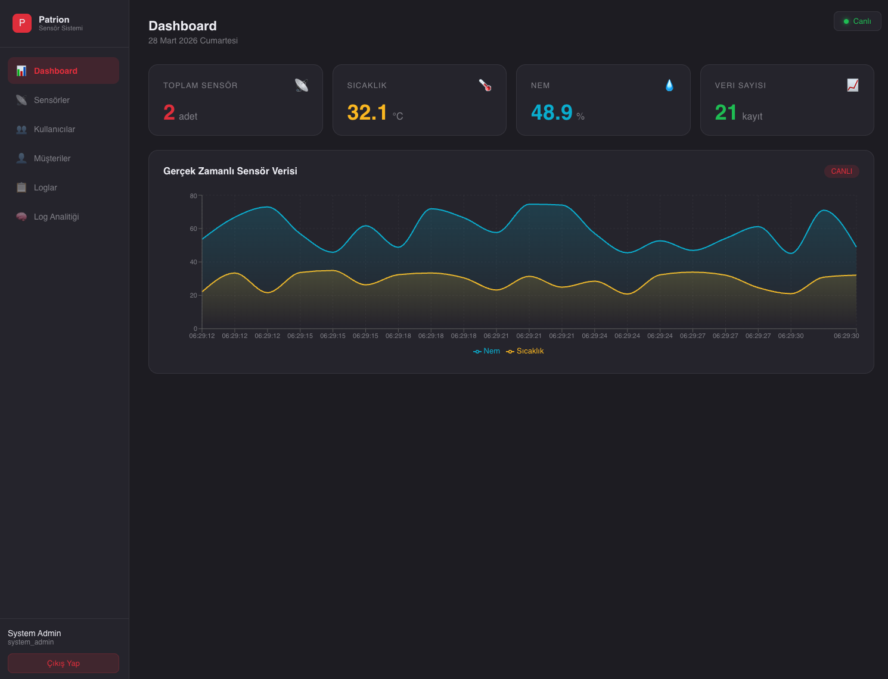
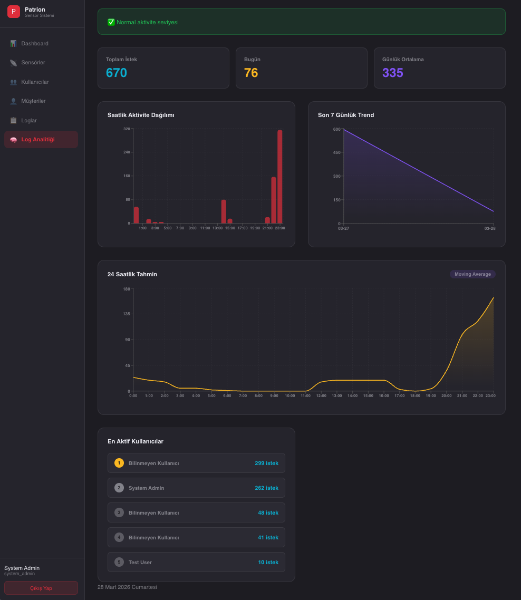

# 🏭 Akıllı Sensör Takip Sistemi

IoT sensörlerinden MQTT protokolü ile veri toplayan, gerçek zamanlı yayınlayan ve kullanıcı davranışlarını analiz eden bir backend servisi ve UI.






## Teknoloji Stack

| Katman | Teknoloji |
|--------|-----------|
| Backend | Node.js + Express + TypeScript |
| Veritabanı | PostgreSQL + InfluxDB |
| Mesajlaşma | MQTT (Mosquitto Broker) |
| Gerçek Zamanlı | WebSocket (Socket.io) |
| Auth | JWT + API Key |
| Frontend | React + Vite + Recharts |
| Container | Docker + Docker Compose |
| CI/CD | GitHub Actions |

## Kurulum

### Gereksinimler
- Docker Desktop
- Node.js 22+
- Git

### 1. Repoyu klonlayın
```bash
git clone https://github.com/MetehanSimsekk/smart-sensor-system.git
cd smart-sensor-system
```

### 2. Environment dosyasını oluşturun
```bash
cp .env.example backend/.env
```
> Varsayılan değerler hazırdır, değiştirmenize gerek yok.

### 3. Docker ile başlat
```bash
docker compose up --build
```

### 4. Seed verilerini yükleyin
```bash
cd backend
npm run seed
```
> Veritabanına test kullanıcıları ve örnek şirket verisi oluşturur. İlk kurulumda bir kez çalıştırmanız yeterlidir.

### 5. Frontend'i başlatın
```bash
cd frontend
npm install
npm run dev
```

### 6. Tarayıcıda açınız
```
http://localhost:5173
```

## Test Kullanıcıları

| Rol | Email | Şifre |
|-----|-------|-------|
| System Admin | admin@patrion.com | Patrion2026 |
| Company Admin | company@patrion.com | Patrion2026 |
| User | user@patrion.com | Patrion2026 |


### Simülatör ile test isterseniz
```bash
npm run simulate:docker
```
> 3 farklı sensörden (temp_sensor_01, temp_sensor_02, temp_sensor_03) her 3 saniyede bir rastgele sıcaklık ve nem verisi üretir. Dashboard'da gerçek zamanlı grafik canlanır.

### Rate Limiting
API'ler DDoS koruması için rate limiting ile korunmaktadır:
- 15 dakikada maksimum 100 istek
- Limit aşılırsa `429 Too Many Requests` döner

### MQTT TLS/SSL
MQTT broker TLS/SSL ile korunmaktadır.Port 8883 üzerinden şifreli bağlantı kurulmaktadır.Self-signed sertifikalar `mosquitto/certs/` klasöründe bulunmaktadır.


### JWT Authentication
Tüm API endpoint'leri JWT token ile korunmaktadır. Token süresi 7 gündür.

### Mosquitto CLI ile tek mesaj göndermek isterseniz : 
```bash
docker exec -it sensor_mosquitto mosquitto_pub \
-h localhost -p 8883 \

  -t sensors/temp_sensor_01 \
  -m '{"sensor_id":"temp_sensor_01","timestamp":1710772800,"temperature":25.4,"humidity":55.2}'
```

## API Endpoints

### Auth
| Method | Endpoint | Açıklama | Auth |
|--------|----------|----------|------|
| POST | /api/auth/login | Giriş yap | Public |
| GET | /api/auth/me | Profil bilgisi | JWT |
| POST | /api/auth/register | Kullanıcı oluştur | System Admin |
| POST | /api/auth/api-key | API Key oluştur | JWT |

### Sensörler
| Method | Endpoint | Açıklama | Auth |
|--------|----------|----------|------|
| GET | /api/sensors | Sensörleri listele | JWT |
| POST | /api/sensors | Sensör ekle | Admin |
| GET | /api/sensors/:id/data | Sensör verisi | JWT |
| DELETE | /api/sensors/:id | Sensör sil | System Admin |

### Kullanıcılar
| Method | Endpoint | Açıklama | Auth |
|--------|----------|----------|------|
| GET | /api/users | Kullanıcıları listele | Admin |
| PUT | /api/users/:id | Kullanıcı güncelle | Admin |
| DELETE | /api/users/:id | Kullanıcı sil | System Admin |

### Şirketler
| Method | Endpoint | Açıklama | Auth |
|--------|----------|----------|------|
| GET | /api/companies | Şirketleri listele | Admin |
| POST | /api/companies | Şirket ekle | System Admin |
| POST | /api/companies/:id/users | Kullanıcı ekle | Admin |
| GET | /api/companies/:id/users/:userId/sensors | Kullanıcı sensörleri | Admin |
| POST | /api/companies/:id/users/:userId/sensors | Sensör ata | Admin |

### Loglar
| Method | Endpoint | Açıklama | Auth |
|--------|----------|----------|------|
| GET | /api/logs | Logları listele | JWT |
| POST | /api/logs | Log oluştur | JWT |
| GET | /api/logs/analytics | Log analitikleri | Admin |

## Docker Servisleri

| Servis | Port | Açıklama |
|--------|------|----------|
| Backend | 3000 | Node.js API |
| PostgreSQL | 5432 | Ana veritabanı |
| InfluxDB | 8086 | Zaman serisi DB |
| Mosquitto | 1883 | MQTT Broker |
| Frontend | 5173 | React UI |

##  Testleri Çalıştırın
```bash
cd backend
npm test
```
## 🌐 Demo

| Servis | URL |
|--------|-----|
| Health Check | https://smart-sensor-system.onrender.com/health |

> Tam sistem testi için `docker compose up` kullanınız.
